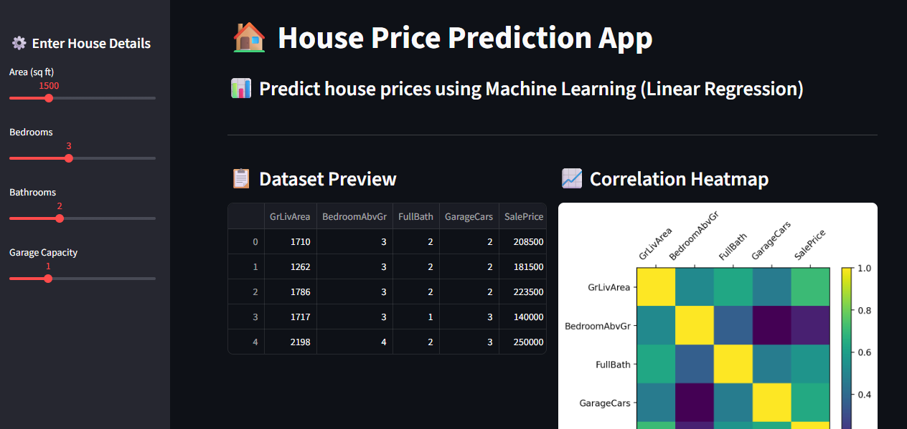
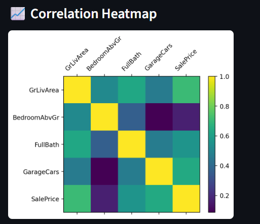
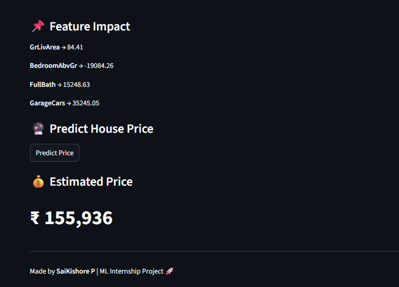

# 🏠 House Price Prediction Web App

This is a Machine Learning web application built using **Streamlit** to predict house prices based on real-world data from Kaggle.

---

---

## 🚀 Features

- 📊 Data visualization (Correlation Heatmap)
- 🤖 Linear Regression Model
- 🔮 Real-time prediction system
- 🌐 Interactive Web App (Streamlit)

---

## 📸 Project Screenshots

### 🖥️ App Interface


### 📊 Correlation Heatmap


### 🔮 Prediction Output


---

## 🛠️ Technologies Used

- Python
- Pandas, NumPy
- Scikit-learn
- Matplotlib
- Streamlit

---

## ▶️ How to Run

```bash
pip install -r requirements.txt
streamlit run app.py